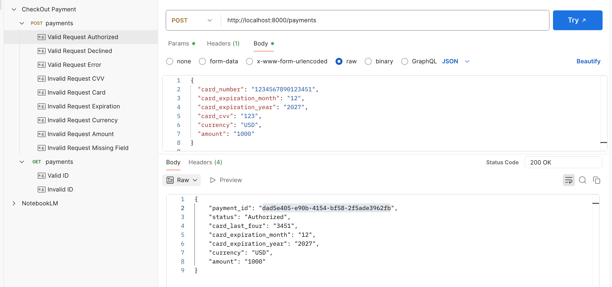

This document provides an overview of my implementation.

### Overview

- payment_gateway_api/datamodels.py
  - Defines the data models for payment requests and payment responses, along with validation logic for each field.

- payment_gateway_api/payment_processor.py
  - Implements the core business logic for payment processing, including submitting payment requests to the bank and retrieving payment details.

- payment_gateway_api/payment_database.py
  - An in-memory database used to mock the behavior of a real database. It supports fetching payment details by ID.
  - In a production environment, a structured persistent database would be more appropriate.

- payment_gateway_api/app.py
  - Exposes all payment-related API endpoints.

- tests/test_payments.py
  - Contains test cases that cover the implemented functionality.

### System Testing
